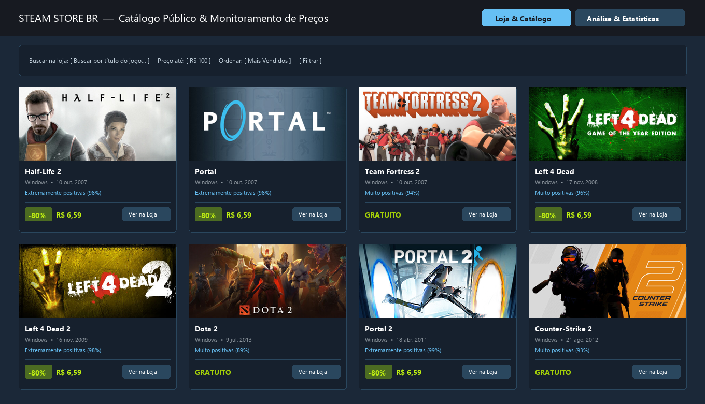
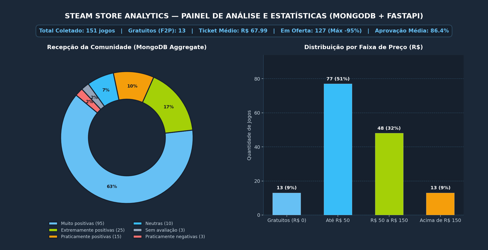

# Steam Store Analytics — Web Crawler, API e Dashboard de Dados

Plataforma de coleta automatizada, armazenamento não relacional, disponibilização via API REST e visualização de dados do catálogo público da **Loja da Steam Brasil**.

---

## Integrantes do Grupo

| Nome | RM |
| :--- | :--- |
| João Pedro Maschion da Cruz Sá | 570509 |
| Gustavo Rezende Louro | 570708 |
| João Pedro Lagonegro Bosco e Silva | 569444 |
| Lucas Henrique Alves da Silva | 572216 |

---

## Visão Geral do Projeto

O projeto realiza o ciclo completo de engenharia e análise de dados a partir da listagem pública de jogos mais vendidos da **Steam Store Brasil** (`store.steampowered.com/search`):

$$\text{Steam Store (Web)} \longrightarrow \text{Web Crawler (Python)} \longrightarrow \text{MongoDB} \longrightarrow \text{API (FastAPI)} \longrightarrow \text{Dashboard Web}$$

1. **Coleta Automatizada (`crawler.py`)**: Acessa múltiplas páginas da busca pública da Steam com `requests` e `BeautifulSoup`, extrai os dados estruturados de cada jogo, limpa e converte os preços em Reais (`R$`) e percentuais de desconto/aprovação, evita registros duplicados pelo identificador único (`appid`) e registra a data/hora e a URL de origem da coleta.
2. **Persistência Não Relacional (`database.py`)**: Armazena os documentos na coleção `jogos` do banco `steam_db` no **MongoDB** utilizando `PyMongo`, mantendo o histórico de coletas anteriores sem apagar registros existentes (`insert_one` / `update_one`) e executando consultas com filtros, ordenações, índices (`create_index`) e pipelines de agregação (`aggregate`).
3. **API REST (`main.py`, `controller.py`, `service.py`)**: Desenvolvida com **FastAPI**, expõe rotas para listagem geral, consulta individual por `appid`, busca combinada com filtros/ordenação e cálculo de estatísticas para alimentar o front-end.
4. **Dashboard Web (`dashboard/index.html`, `dashboard/script.js`)**: Interface dividida em duas visões navegáveis pelo cabeçalho (**Loja & Catálogo** e **Análise & Estatísticas**), estilizada com **Tailwind CSS** e ícones vetoriais SVG, consumindo exclusivamente os endpoints da API FastAPI via `fetch()`.

---

## Interface do Sistema

### 1. Página Loja & Catálogo
Vitrine interativa com busca por título, filtro por teto de preço em `R$`, filtro de ofertas ativas, ordenação dinâmica e alternância entre visualização em **Cards da Loja** e **Tabela Completa**.



### 2. Página Análise & Estatísticas
Painel analítico dedicado contendo os indicadores gerais do catálogo (total de jogos coletados, títulos gratuitos, ticket médio dos jogos pagos, total em promoção e média de aprovação da comunidade), **Gráfico de Rosca (Recepção da Comunidade)**, **Gráfico de Colunas Verticais (Distribuição por Faixa de Preço)** e o ranking dos maiores descontos coletados.



---

## Arquitetura e Organização em Módulos

```text
steam-store-analytics/
├── crawler.py          # Módulo de Coleta: Web Crawler da Steam (BeautifulSoup, POO, Try/Except e Logs)
├── database.py         # Módulo de Persistência: Conexão PyMongo, índices, upsert e agregações no MongoDB
├── service.py          # Módulo de Regras de Negócio: Filtros de busca, ordenações e cálculos estatísticos
├── controller.py       # Módulo de Rotas HTTP: Endpoints REST registrados no APIRouter do FastAPI
├── main.py             # Inicialização da aplicação FastAPI e configuração de CORS
├── dashboard/
│   ├── index.html      # Interface web (Loja & Catálogo + Painel de Análise e Estatísticas)
│   └── script.js       # Consumo assíncrono da API FastAPI (fetch) e manipulação do DOM
├── assets/
│   ├── preview_loja.png
│   └── preview_estatisticas.png
├── requirements.txt    # Dependências Python do projeto
└── README.md           # Documentação técnica
```

---

## Estrutura dos Documentos no MongoDB

- **Banco de Dados (`db`)**: `steam_db`
- **Coleção (`collection`)**: `jogos`
- **Índices configurados**: `appid`, `preco_final` e índice composto `[("avaliacao_resumo", 1), ("preco_final", 1)]`

Exemplo de documento armazenado na coleção `jogos`:

```json
{
  "appid": 570,
  "titulo": "Dota 2",
  "data_lancamento": "9 jul. 2013",
  "preco_original": 0.0,
  "preco_final": 0.0,
  "desconto_pct": 0,
  "gratuito": true,
  "em_promocao": false,
  "avaliacao_resumo": "Muito positivas",
  "avaliacao_positiva_pct": 89,
  "plataformas": ["Windows", "Mac", "Linux"],
  "imagem": "https://shared.fastly.steamstatic.com/store_item_assets/steam/apps/570/capsule_231x87.jpg",
  "url_origem": "https://store.steampowered.com/app/570/Dota_2/",
  "fonte": "Steam Store Brasil",
  "data_coleta": "07/10/2026 10:21:42"
}
```

---

## Documentação dos Endpoints da API (`FastAPI`)

Com o servidor ativo, a documentação interativa (Swagger UI) fica disponível em `http://localhost:8000/docs`.

| Método | Endpoint | Descrição | Parâmetros Opcionais (Query / Path) |
| :--- | :--- | :--- | :--- |
| `GET` | `/jogos` | Lista todos os jogos armazenados no MongoDB. | — |
| `GET` | `/jogos/busca` | Filtra e ordena os jogos coletados. | `termo`, `avaliacao`, `apenas_promocao`, `apenas_gratuitos`, `preco_max`, `ordenar_por` |
| `GET` | `/jogos/estatisticas` | Retorna os KPIs consolidados, dados dos gráficos e ranking de ofertas. | — |
| `GET` | `/jogos/{appid}` | Busca os dados de um jogo específico pelo código `appid` da Steam (retorna `404` caso não exista). | `appid` (int) |
| `POST` | `/jogos/coletar` | Dispara uma nova coleta do Web Crawler atualizando os registros sem apagar os anteriores. | `paginas` (int, padrão `6`) |

---

## Instruções para Instalação e Execução

### 1. Instalar as dependências
No terminal, dentro da pasta do projeto:

```bash
pip install -r requirements.txt
```
*(No Windows, caso o comando `pip` não esteja no PATH, utilize `py -m pip install -r requirements.txt`).*

### 2. Executar o Web Crawler (Coleta Independente)
Para coletar as páginas da Steam e popular o banco de dados MongoDB:

```bash
python crawler.py
```
*(Ou `py crawler.py` no Windows).*

### 3. Iniciar o Servidor da API FastAPI
```bash
uvicorn main:app --reload
```
*(Ou `py -m uvicorn main:app --reload` no Windows).*

A API ficará disponível em `http://localhost:8000` e o Swagger em `http://localhost:8000/docs`.

### 4. Abrir o Dashboard Web
Com a API rodando, abra o arquivo `dashboard/index.html` no navegador (dando dois cliques no arquivo ou utilizando a extensão *Live Server* do VS Code).
